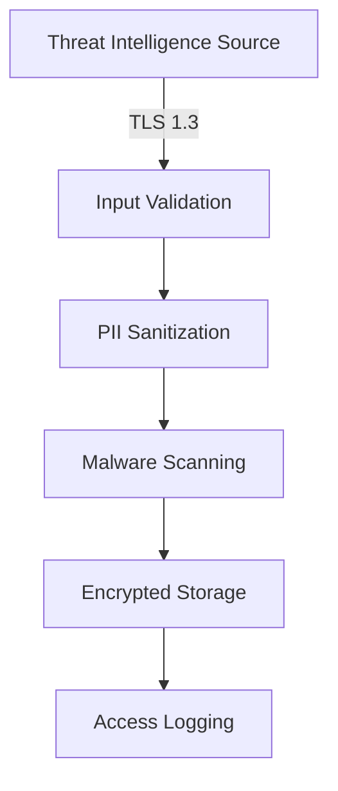

# ThreatResearchHub Development Manifest

## Platform Capabilities and Architecture

This document outlines the comprehensive capabilities, architecture, and technical implementation details of ThreatResearchHub.

## Executive Summary

Threat intelligence to detection and response content development platform with vendor-agnostic architecture.

## Core Platform Capabilities

### 1. Multi-Source Threat Intelligence Ingestion

#### Supported Input Methods
- **Automated Feed Integration**: CISA, NIST NVD, Unit42, SANS ISC, Threatpost
- **URL Import**: Direct web-based threat report ingestion with content extraction
- **PDF Processing**: OCR-enabled document parsing with structured data extraction
- **Manual Entry**: Guided threat intelligence input with validation
- **API Integration**: RESTful APIs for programmatic intelligence submission

#### Processing Capabilities
- **Natural Language Processing**: Automated IOC extraction from unstructured text
- **MITRE ATT&CK Mapping**: Intelligent technique and tactic classification
- **IOC Categorization**: Automatic sorting by type, confidence, and relevance
- **Temporal Analysis**: Threat timeline construction and evolution tracking
- **Confidence Scoring**: ML-powered relevance and accuracy assessment

### 2. Vendor-Agnostic Security Stack Integration

#### Supported Platform Categories

##### SIEM Platforms
- **Palo Alto Networks XSIAM**: Full XQL query generation and API integration
- **Splunk Enterprise/Cloud**: SPL query creation and dashboard deployment
- **Microsoft Sentinel**: KQL rule generation and Logic Apps integration
- **IBM QRadar**: AQL query creation and custom rule deployment
- **Elastic Security**: Lucene query syntax and detection rule creation
- **Google Chronicle**: YARA-L rule generation and hunt deployment

##### Endpoint Detection and Response (EDR)
- **Cortex XDR**: Behavioral analytics and custom detection rules
- **CrowdStrike Falcon**: Custom IOA creation and hunting queries
- **SentinelOne**: Deep Visibility queries and response automation
- **Microsoft Defender for Endpoint**: Advanced hunting queries and custom detections

##### Network Security
- **Palo Alto Networks Firewalls**: Custom security policies and threat signatures
- **Check Point**: SmartConsole rule creation and threat emulation
- **Fortinet FortiGate**: FortiGuard signature updates and policy automation

##### Security Orchestration, Automation, and Response (SOAR)
- **Cortex XSOAR**: Playbook automation and incident response workflows
- **Splunk Phantom**: Automated response actions and case management
- **IBM Resilient**: Incident orchestration and timeline construction

##### Attack Surface Management (ASM)
- **Cortex Xpanse**: External asset discovery and exposure monitoring
- **Censys**: Internet-wide asset enumeration and vulnerability tracking
- **Shodan**: IoT device discovery and security assessment

##### Attack Simulation and Validation
- **Breach Attack Simulation (BAS)**: Automated security control testing
- **Stratus Red Team**: Cloud-focused attack simulation
- **Kali Linux**: Penetration testing and security assessment tools
- **MITRE Caldera**: Adversary emulation and technique validation

### 3. Content Generation Engine

#### Query Language Support
- **XQL (XSIAM)**: Advanced threat hunting and detection queries
- **SPL (Splunk)**: Search processing language for log analysis
- **KQL (Sentinel)**: Kusto query language for Azure-native detection
- **AQL (QRadar)**: Ariel query language for IBM security analytics
- **Lucene (Elastic)**: Full-text search and complex filtering
- **YARA-L (Chronicle)**: Google's detection rule format

#### Automated Content Types

##### Detection Rules
```xql
// Example: Advanced PowerShell Attack Detection
dataset = xdr_data
| filter agent_os_type = AGENT_OS_WINDOWS
| filter action_process_image_name ~= ".*powershell.*"
| filter action_process_command_line contains "-EncodedCommand" 
    or action_process_command_line contains "-WindowStyle Hidden"
    or action_process_command_line contains "DownloadString"
| alter suspicious_indicators = arraycount(arrayfilter(
    split(action_process_command_line, " "), 
    "@element" in ("bypass", "unrestricted", "hidden", "encoded")
))
| filter suspicious_indicators >= 2
| fields _time, agent_hostname, action_process_command_line, suspicious_indicators
```

##### Alert Layouts
```json
{
  "alertLayout": {
    "title": "{{threat_name}} Detection",
    "severity": "{{calculated_severity}}",
    "sections": [
      {
        "title": "Threat Overview",
        "fields": ["threat_description", "mitre_techniques", "confidence_score"]
      },
      {
        "title": "Affected Assets",
        "fields": ["hostname", "ip_address", "user_account", "process_details"]
      },
      {
        "title": "Recommended Actions",
        "actions": [
          {"label": "Isolate Host", "type": "containment", "api": "/isolate"},
          {"label": "Block IOCs", "type": "prevention", "api": "/block"},
          {"label": "Hunt Similar", "type": "investigation", "api": "/hunt"}
        ]
      }
    ]
  }
}
```

##### SOAR Playbooks
```yaml
playbook:
  name: "{{threat_name}}_Response"
  trigger:
    type: "alert"
    conditions:
      - field: "alert_name"
        equals: "{{threat_name}}_Detection"
  tasks:
    - id: "enrich_indicators"
      type: "enrichment"
      script: "ThreatIntelligence.enrich_iocs"
      inputs:
        iocs: "{{alert.indicators}}"
    - id: "investigate_host"
      type: "investigation"
      script: "HostForensics.collect_artifacts"
      inputs:
        hostname: "{{alert.hostname}}"
    - id: "containment_decision"
      type: "decision"
      conditions:
        - if: "{{enrich_indicators.confidence}} > 0.8"
          then: "execute_containment"
        - else: "manual_review"
```

##### Operational Dashboards
- **Executive Summary**: High-level threat landscape overview
- **SOC Operations**: Real-time alert queues and investigation status
- **Threat Intelligence**: IOC feeds, campaign tracking, attribution
- **Performance Metrics**: Detection coverage, response times, efficiency KPIs

### 4. Advanced Analytics and Machine Learning

#### Threat Intelligence Analytics
- **Campaign Attribution**: Link related threats across time and infrastructure
- **TTPs Evolution**: Track technique progression and adaptation
- **Predictive Modeling**: Forecast likely attack vectors and timing
- **Anomaly Detection**: Identify unusual patterns in threat data

#### Detection Optimization
- **False Positive Reduction**: ML-powered rule tuning and optimization
- **Coverage Gap Analysis**: Identify blind spots in detection capabilities
- **Performance Optimization**: Query efficiency and resource utilization
- **Adaptive Thresholds**: Dynamic adjustment based on environmental factors

### 5. Lab Environment Orchestration

#### Infrastructure as Code
```yaml
# Azure Container Instances Deployment
apiVersion: 2019-12-01
location: eastus
properties:
  containers:
  - name: threat-research-lab
    properties:
      image: threatresearchhub/lab:latest
      resources:
        requests:
          cpu: 2
          memoryInGb: 4
      ports:
      - port: 8080
        protocol: TCP
  osType: Linux
  ipAddress:
    type: Public
    ports:
    - protocol: tcp
      port: 8080
```

#### Supported Deployment Platforms
- **Docker**: Containerized lab environments with authentic attack scenarios
- **Kubernetes**: Scalable orchestration for complex multi-service labs
- **containerd**: Lightweight container runtime for resource-constrained environments
- **Proxmox**: Virtual machine management for traditional infrastructure
- **VMware**: Enterprise virtualization platform integration
- **Major Cloud Platforms**: AWS, Azure, GCP native service deployment

#### Lab Environment Types
- **Endpoint Security Labs**: Windows/Linux endpoint compromise scenarios
- **Cloud Security Labs**: AWS/Azure misconfigurations and attacks
- **Network Security Labs**: Lateral movement and network reconnaissance
- **Identity Security Labs**: Authentication bypass and privilege escalation
- **Container Security Labs**: Docker escape and Kubernetes exploitation

### 6. Security and Compliance

#### Data Protection
- **PII Sanitization**: Browser-based homographic character transformation
- **Zero Data Transmission**: All sensitive processing occurs locally
- **Encryption at Rest**: AES-256 encryption for stored threat intelligence
- **Encryption in Transit**: TLS 1.3 for all API communications
- **Access Controls**: Role-based permissions and multi-factor authentication

#### Compliance Framework Support
- **SOC 2 Type II**: Security operations center compliance
- **ISO 27001**: Information security management systems
- **NIST Cybersecurity Framework**: Comprehensive security controls
- **GDPR**: Data protection and privacy compliance
- **HIPAA**: Healthcare information security requirements

## Technical Architecture

### Frontend Architecture

#### Technology Stack
- **React 18**: Modern component-based UI framework
- **TypeScript**: Type-safe JavaScript development
- **Tailwind CSS**: Utility-first CSS framework
- **Shadcn/UI**: Professional component library
- **Wouter**: Lightweight client-side routing
- **TanStack Query**: Server state management and caching

#### Component Architecture
```typescript
// Example: Threat Intelligence Component
interface ThreatIntelligenceProps {
  source: 'feed' | 'url' | 'pdf' | 'manual';
  onProcessComplete: (intelligence: ProcessedThreat) => void;
}

export const ThreatIntelligenceIngestion: React.FC<ThreatIntelligenceProps> = ({
  source,
  onProcessComplete
}) => {
  const { mutate: processIntelligence, isLoading } = useMutation({
    mutationFn: (data: ThreatData) => threatIntelligenceApi.process(data),
    onSuccess: (processed) => {
      onProcessComplete(processed);
      toast.success('Threat intelligence processed successfully');
    }
  });

  return (
    <Card className="threat-intelligence-card">
      <CardHeader>
        <CardTitle>Threat Intelligence Ingestion</CardTitle>
      </CardHeader>
      <CardContent>
        {/* Dynamic input components based on source type */}
      </CardContent>
    </Card>
  );
};
```

### Backend Architecture

#### Technology Stack
- **Node.js**: JavaScript runtime environment
- **Express.js**: Web application framework
- **TypeScript**: Type-safe server development
- **Drizzle ORM**: Type-safe database operations
- **PostgreSQL**: Relational database for structured data
- **Redis**: Caching and session management

#### Service Architecture
```typescript
// Example: Security Stack Manager
export class SecurityStackManager {
  private adapters: Map<string, SecurityAdapter> = new Map();

  constructor() {
    this.registerAdapters();
  }

  private registerAdapters(): void {
    // SIEM Adapters
    this.adapters.set('siem:xsiam', new XSIAMAdapter());
    this.adapters.set('siem:splunk', new SplunkAdapter());
    this.adapters.set('siem:sentinel', new SentinelAdapter());
    
    // EDR Adapters
    this.adapters.set('edr:cortex_xdr', new CortexXDRAdapter());
    this.adapters.set('edr:crowdstrike', new CrowdStrikeAdapter());
    
    // Additional platform adapters...
  }

  async generateContent(
    platform: string,
    threatIntelligence: ThreatIntelligence
  ): Promise<SecurityContent> {
    const adapter = this.adapters.get(platform);
    if (!adapter) {
      throw new Error(`Unsupported platform: ${platform}`);
    }

    return adapter.generateContent(threatIntelligence);
  }
}
```

#### Content Generation Orchestrator
```typescript
export class ContentGenerationOrchestrator {
  private stackManager: SecurityStackManager;
  private queryMappings: QueryMappingService;
  private templates: ContentTemplateService;

  async generateMultiPlatformContent(
    intelligence: ThreatIntelligence,
    targetPlatforms: string[]
  ): Promise<MultiPlatformContent> {
    const results: MultiPlatformContent = {};

    for (const platform of targetPlatforms) {
      try {
        // Generate platform-specific queries
        const queries = await this.queryMappings.generateQueries(
          intelligence,
          platform
        );

        // Apply platform templates
        const content = await this.templates.applyTemplates(
          platform,
          queries,
          intelligence
        );

        // Validate generated content
        const validatedContent = await this.validateContent(platform, content);

        results[platform] = validatedContent;
      } catch (error) {
        console.error(`Failed to generate content for ${platform}:`, error);
        results[platform] = { error: error.message };
      }
    }

    return results;
  }
}
```

### Database Schema

#### Core Tables
```sql
-- Threat Intelligence Storage
CREATE TABLE threat_reports (
  id SERIAL PRIMARY KEY,
  title VARCHAR(255) NOT NULL,
  description TEXT,
  source VARCHAR(100) NOT NULL,
  confidence_score DECIMAL(3,2),
  severity VARCHAR(20),
  mitre_techniques TEXT[],
  iocs JSONB,
  created_at TIMESTAMP DEFAULT NOW(),
  updated_at TIMESTAMP DEFAULT NOW()
);

-- Security Stack Configurations
CREATE TABLE security_stacks (
  id SERIAL PRIMARY KEY,
  name VARCHAR(100) NOT NULL,
  platforms JSONB NOT NULL,
  api_configurations JSONB,
  created_by INTEGER REFERENCES users(id),
  created_at TIMESTAMP DEFAULT NOW()
);

-- Generated Content Tracking
CREATE TABLE generated_content (
  id SERIAL PRIMARY KEY,
  threat_report_id INTEGER REFERENCES threat_reports(id),
  security_stack_id INTEGER REFERENCES security_stacks(id),
  platform VARCHAR(50) NOT NULL,
  content_type VARCHAR(50) NOT NULL,
  content JSONB NOT NULL,
  validation_status VARCHAR(20) DEFAULT 'pending',
  created_at TIMESTAMP DEFAULT NOW()
);
```

### API Design

#### RESTful Endpoints
```typescript
// Threat Intelligence API
POST   /api/threat-intelligence/process     // Process new threat intelligence
GET    /api/threat-intelligence/:id         // Retrieve processed intelligence
PUT    /api/threat-intelligence/:id         // Update threat intelligence
DELETE /api/threat-intelligence/:id         // Delete threat intelligence

// Security Stack API
POST   /api/security-stacks                 // Create security stack configuration
GET    /api/security-stacks                 // List configured stacks
PUT    /api/security-stacks/:id             // Update stack configuration
DELETE /api/security-stacks/:id             // Delete stack configuration

// Content Generation API
POST   /api/content/generate                // Generate multi-platform content
GET    /api/content/:id                     // Retrieve generated content
POST   /api/content/validate                // Validate content syntax
POST   /api/content/deploy                  // Deploy content to platforms

// Lab Environment API
POST   /api/labs/deploy                     // Deploy lab environment
GET    /api/labs/:id/status                 // Check deployment status
POST   /api/labs/:id/test                   // Execute attack simulation
DELETE /api/labs/:id                        // Destroy lab environment
```

## Development Roadmap

### Current Implementation Status

#### Completed Features ✅
- Multi-source threat intelligence ingestion
- MITRE ATT&CK mapping and IOC extraction
- Security stack configuration
- XQL query generation for XSIAM
- React-based frontend with TypeScript
- PostgreSQL database integration
- Docker containerization support

#### In Development 🚧
- Advanced multi-platform query generation
- SOAR playbook automation templates
- Enhanced lab environment orchestration
- Machine learning-powered optimization
- Real-time threat intelligence feeds

#### Planned Features 📋
- Enterprise authentication and authorization
- Advanced analytics and reporting
- Cloud-native deployment options
- Extended platform adapter library
- Mobile-responsive interface enhancements

### Performance Specifications

#### Scalability Targets
- **Concurrent Users**: 1,000+ simultaneous users
- **Threat Processing**: 10,000+ IOCs per minute
- **Query Generation**: Sub-second response times
- **Lab Deployment**: <5 minutes to full environment
- **Platform Integration**: 99.9% API reliability

#### Resource Requirements

##### Minimum System Requirements
- **CPU**: 4 cores, 2.4 GHz
- **Memory**: 8 GB RAM
- **Storage**: 100 GB SSD
- **Network**: 100 Mbps bandwidth

##### Recommended Production Environment
- **CPU**: 16 cores, 3.2 GHz
- **Memory**: 64 GB RAM
- **Storage**: 1 TB NVMe SSD
- **Network**: 1 Gbps bandwidth
- **High Availability**: Load-balanced multi-instance deployment

## Security Architecture

### Threat Model

#### Assets to Protect
- **Threat Intelligence Data**: Raw and processed intelligence
- **Customer Configurations**: Security stack settings and credentials
- **Generated Content**: Detection rules, playbooks, and dashboards
- **User Data**: Authentication credentials and session information

#### Potential Threats
- **Data Exfiltration**: Unauthorized access to sensitive threat intelligence
- **Configuration Tampering**: Malicious modification of security settings
- **Credential Compromise**: Theft of API keys and authentication tokens
- **Service Disruption**: Denial of service attacks on platform availability

#### Security Controls
- **Defense in Depth**: Multiple layers of security controls
- **Zero Trust Architecture**: Verify every request and transaction
- **Encryption Everywhere**: Data protection in transit and at rest
- **Continuous Monitoring**: Real-time security event detection

### Data Flow Security

#### Ingestion Security


#### Processing Security
- **Input Validation**: Comprehensive data validation and sanitization
- **Sandbox Execution**: Isolated processing environments
- **Output Validation**: Generated content verification
- **Audit Logging**: Complete transaction trail

## Integration Capabilities

### Third-Party Integrations

#### Threat Intelligence Feeds
- **Commercial Feeds**: CrowdStrike, FireEye, Recorded Future
- **Open Source Feeds**: MISP, OTX, ThreatConnect
- **Government Feeds**: US-CERT, EU-CERT, National CSIRTs
- **Industry Feeds**: FS-ISAC, H-ISAC, sector-specific intelligence

#### SIEM/SOAR Platforms
- **Native APIs**: Direct platform integration
- **Webhook Support**: Real-time event notifications
- **Bulk Import/Export**: Large-scale data operations
- **Custom Connectors**: Extensible integration framework

#### Cloud Platforms
- **AWS Integration**: CloudFormation, Lambda, SecurityHub
- **Azure Integration**: ARM templates, Logic Apps, Sentinel
- **GCP Integration**: Deployment Manager, Cloud Functions, Chronicle
- **Multi-Cloud**: Unified management across cloud providers

## Quality Assurance

### Testing Framework

#### Automated Testing
- **Unit Tests**: 90%+ code coverage requirement
- **Integration Tests**: End-to-end workflow validation
- **Performance Tests**: Load testing and benchmark validation
- **Security Tests**: Vulnerability scanning and penetration testing

#### Quality Metrics
- **Code Quality**: SonarQube analysis and technical debt tracking
- **Performance**: Response time and throughput monitoring
- **Reliability**: Uptime and error rate measurement
- **User Experience**: Usability testing and feedback integration

### Continuous Integration/Continuous Deployment (CI/CD)

#### Pipeline Architecture
```yaml
stages:
  - security-scan
  - unit-tests
  - integration-tests
  - performance-tests
  - staging-deployment
  - security-validation
  - production-deployment
  - post-deployment-monitoring
```

#### Quality Gates
- **Code Review**: Mandatory peer review for all changes
- **Automated Testing**: All tests must pass before deployment
- **Security Scanning**: No high-severity vulnerabilities allowed
- **Performance Validation**: No regression in key metrics

## Conclusion

ThreatResearchHub represents a paradigm shift in threat intelligence platform design, offering unprecedented flexibility and capability in a unified solution. The vendor-agnostic architecture ensures organizations can leverage their existing security investments while preparing for future technology evolution.

The platform's comprehensive approach to threat intelligence processing, multi-platform content generation, and automated lab deployment provides security teams with the tools necessary to stay ahead of evolving threats while maintaining operational efficiency and security excellence.

This development manifest serves as the technical foundation for continued platform evolution and expansion, ensuring consistent quality and capability growth as new features and integrations are added to the ThreatResearchHub ecosystem.